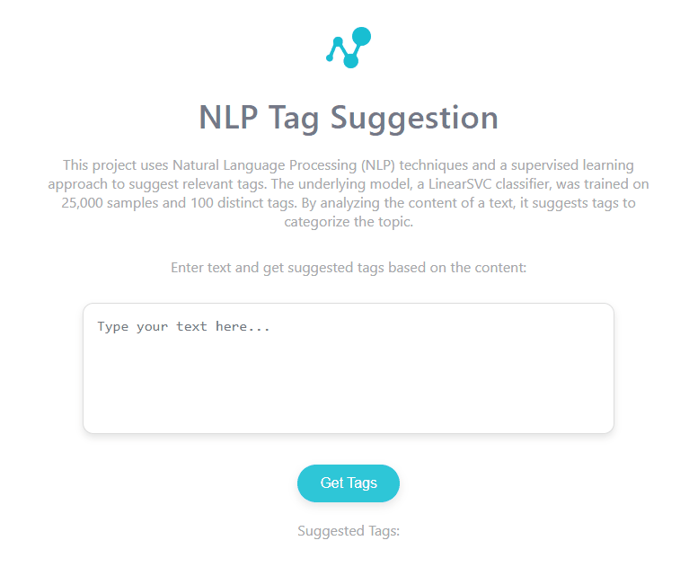

# Development and Deployment of a Prediction API on AWS

This section outlines the process of developing and deploying a prediction API for tag suggestion based on user-submitted text. The API leverages the machine learning models trained in the project and is hosted on AWS, with an integrated user interface hosted on GitHub Pages.

[>>> Click here to test the API](https://misszeferino.github.io/NLP-Multilabel-Classification/)

## 1. Architecture Overview

The API architecture is built using the following AWS services:
- **API Gateway**: Handles POST requests and routes them to the backend.
- **AWS Lambda**: Processes API requests and runs the tag prediction logic.
- **Amazon EC2**: Hosts the backend components. A Docker image was created locally and deployed on an EC2 instance for streamlined management of dependencies and scalability.
- **CloudWatch**: Monitors logs, debugs issues, and tracks performance for API Gateway and Lambda functions.

## 2. Integration and Configuration

Key configuration steps included:
- Mapping API Gateway request parameters to ensure seamless communication with Lambda and EC2.
- Deploying the backend logic via Docker, ensuring that dependencies are encapsulated within the container.
- Establishing a GitHub webhook that triggers an API Gateway POST request upon project updates.

## 3. Testing and Validation

Extensive testing was conducted using Postman to verify API functionality and integration with AWS services. The following were validated:
- End-to-end communication between API Gateway, Lambda, and the EC2-hosted backend.
- Accurate and efficient tag predictions in response to user input.
